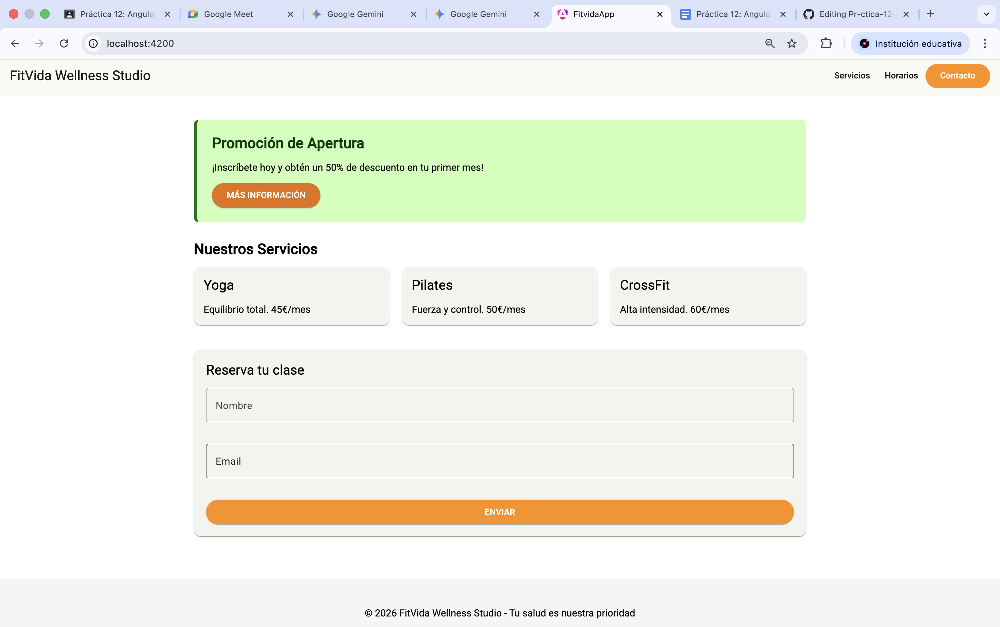

# Práctica 12: Angular y Material - FitVida Wellness Studio

**Alumno:** [Harold Andres Ponce Pachon]  
**Módulo:** Desarrollo Web en Entorno Cliente

---

## 📝 Descripción del Proyecto
Este proyecto es una aplicación web para un centro de bienestar llamado **FitVida**. Se ha desarrollado utilizando **Angular** y **Angular Material**, implementando un sistema de temas personalizado basado en las especificaciones del cliente (#2E7D32 y #FF8F00).

### Características principales:
* **Tema personalizado:** Uso de `mat.define-theme` con paletas verde (primary) y naranja (tertiary).
* **Componente personalizado:** Implementación de `hero-card` mediante el uso de Mixins de Sass y la función `mat.get-theme-color`.
* **Componentes Material:** Uso de `mat-toolbar`, `mat-card`, `mat-button`, `mat-form-field` y `mat-chips`.

---

## 🚀 Instrucciones de ejecución

Para poner en marcha el proyecto en tu equipo local, sigue estos pasos:

1. **Instalar dependencias:**
   Abre la terminal en la carpeta del proyecto y ejecuta:
   ```bash
   npm install
   ```

2. **Ejecutar el servidor de desarrollo:**
    Una vez instaladas las dependencias, lanza la aplicación con:
    ```bash
    ng serve
    ```

3. **Acceder al navegador:**
    Abre http://localhost:4200/ para ver la aplicación funcionando.

4. **Captura de Pantalla:**
